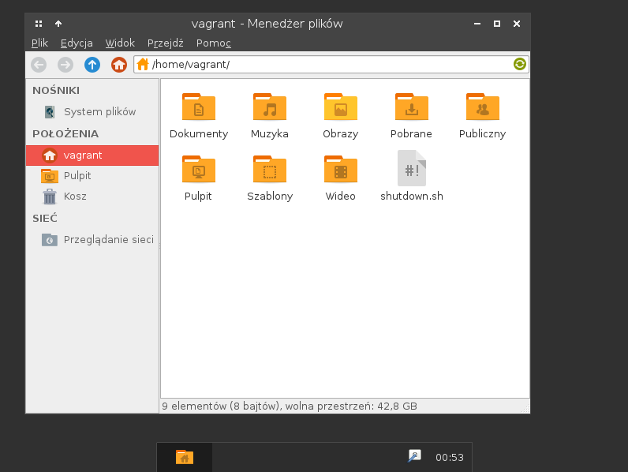

# What is this?
This is a **vagrant** file and provisioning scripts for generating a VM in Virtualbox usefull in node development in a AppGate-secured dev environment.
It's a **Debian 9.11** machine with **50GB** harddrive, **polish** locale and **Openbox** window manager. You can build the vagrant base-box yourself if you want and tweak the packer scripts to your liking - see the "I DON'T trust the author" section. 

# I trust the author:
    apt install vagrant
    git clone https://github.com/lukaszmalik/debian9-pl-work-vm.git work-vm
    cd work-vm
    vagrant up
    vagrant reload

# I DON'T trust the author:
    apt install packer vagrant
    git clone https://github.com/lukaszmalik/debian9-pl-work-vm.git work-vm
    cd work-vm/packer
    packer build debian-9-stretch-virtualbox.json
    vagrant box add debian9.11 ./debian9.11.box
    cd ..
    sed -i 's/finch\/debian9.11-pl-50gb/debian9.11/g' Vagrantfile
    vagrant up
    vagrant reload

# Screenshot:

